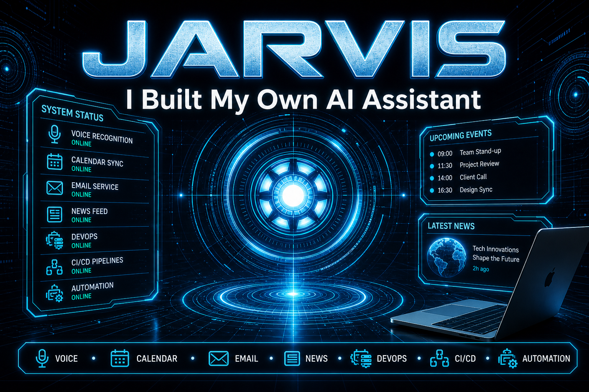

# JARVIS — Personal AI Assistant

[](https://www.youtube.com/watch?v=VaxTmoVI4UU)

> 📺 **[Watch the demo on YouTube — JARVIS: I Built My Own AI Assistant](https://www.youtube.com/watch?v=VaxTmoVI4UU)**

A real-time voice AI that can hear, see, understand, and control your computer — on Windows, macOS, and Linux. Built on the Gemini Live API for native audio streaming, with a JARVIS-style HUD interface.

**Built by [Flavio Silva](https://github.com/flaviorssilva1981)** — DevOps engineer. Calendar, mail, weather, news briefings, and automation workflows.

---

## ✨ Overview

JARVIS is a cross-platform personal AI assistant with a futuristic HUD UI. It remembers context across sessions, delivers morning briefings, and responds by voice or text. On macOS, it includes real **Calendar.app**, **Mail.app**, and **Open-Meteo weather** integrations — no hallucinated calendar or inbox data.

Use it for daily briefings, DevOps questions, CI/CD pipeline help, automation tasks, hands-free computer control, and **voice-driven Google Slides presentations**.

---

## 🚀 Capabilities

### Core Features
| Feature | Description |
|---|---|
| 🎙️ Real-time Voice | Ultra-low latency conversation via Gemini Live API |
| 🖥️ System Control | Launch apps, adjust volume/brightness, WiFi, shortcuts, power — all by voice |
| 🧩 Autonomous Tasks | High-level planning for complex multi-step goals via agent mode |
| 👁️ Visual Awareness | Real-time screen capture and webcam vision piped into your Gemini session |
| 🧠 Persistent Memory | Remembers projects, preferences, and personal context across sessions |
| ⌨️ Hybrid Input | Seamlessly switch between keyboard typing and voice commands |
| 🌅 Morning Briefing | On first boot: greets you, reads the time, recaps yesterday, and fetches live news |
| 🔔 Proactive 2.0 | Time-aware, context-aware check-ins |
| 🗓️ Session Memory | Summarises each conversation and mentions it naturally next morning |
| 👁️‍🗨️ Background Monitoring | User-configured topic watching — daily headline checks |
| 📊 Hardware Monitoring | CPU, RAM, GPU and temperature telemetry with voice alerts |
| 🌤️ Weather Report | Live weather via Open-Meteo (°C, km/h) — spoken and shown in the HUD |
| 🗓️ Calendar (macOS) | Reads real events from Calendar.app via AppleScript |
| 📧 Mail Inbox (macOS) | Reads recent inbox messages from Mail.app |
| 🗺️ Dynamic Content Panel | Scrollable display beneath the HUD for web results, news, and weather |
| 🔍 Multi-Mode Web Search | `news` / `research` / `price` / `compare` / `search` — Gemini + DDG fallback |
| ⏰ Smart Reminders | OS-native scheduled notifications |
| ✈️ Flight Finder | Live flight price and availability lookup |
| 🎮 Game Updater | Checks and triggers game updates on Steam and Epic Games |
| 📂 File Processor | Read, summarize, and answer questions about local files |
| 💻 Code Helper | Inline code review, debugging, and generation |
| 🧑‍💻 Dev Agent | DevOps / automation task agent (Ansible, CI/CD, scripting) |
| 🌐 Browser Control | Open URLs, navigate tabs, compose email in Gmail |
| 📨 Send Message | Compose and send messages through WhatsApp, Telegram, and more |
| 🎬 YouTube Control | Search, play, and control YouTube playback by voice |
| 📊 Google Slides Presenter | Present Google Slides in Chrome — narrate each slide, next/previous, jump to topic (e.g. SLO) |
| 🖱️ Desktop Control | Taskbar, window management, and desktop-level operations |
| 📱 Remote Dashboard | Control the assistant from your phone via QR code pairing |
| ⚡ Auto-Start on Boot | Registers with the OS startup system |
| 📋 Clipboard Intelligence | Copy any text → floating panel with Translate / Summarise / Explain / Fix |
| 🎨 Assistant Customization | Change the assistant name and your name from the UI |

---

## 📊 Google Slides Presenter

Present decks from **Google Drive in Chrome** — no local PowerPoint required.

| Voice command | What JARVIS does |
|---|---|
| *"Present my Google Slides: [URL]"* | Opens `/present` in Chrome, narrates each slide, advances automatically |
| *"Next slide"* / *"Previous slide"* | Moves forward or back in the slideshow |
| *"Go to the slide about SLO"* | Finds and jumps to a slide by topic, then explains it |
| *"Go to slide 5"* | Jumps to a specific slide number |
| *"Explain this slide"* | Narrates the current slide without advancing |
| *"Stop the presentation"* | Ends the slideshow |

**Requirements:** Google account logged in to Chrome. On macOS, grant **Terminal** access to **Screen Recording** (slide capture) and **Accessibility** (arrow keys for slide navigation).

**Optional:** Export the deck as `.pptx` for faster topic search when jumping to subjects like DevOps or SLO.

---

## ⚡ Quick Start

```bash
git clone https://github.com/flaviorssilva1981/jarvis-ai.git
cd jarvis-ai
python3 -m venv .venv
source .venv/bin/activate   # Windows: .venv\Scripts\activate
pip install -r requirements.txt
cp config/api_keys.json.example config/api_keys.json
# Edit config/api_keys.json — add your Gemini API key and settings
./start.sh                  # macOS/Linux launcher with logging
# or: python main.py
```

> ⚠️ **Installation Note:** Some OS-specific dependencies are not bundled in `requirements.txt`. If you hit a `ModuleNotFoundError`, install the missing package with `pip install <module_name>`.

### macOS permissions

Grant **Terminal** (or your launcher app) access to **Mail**, **Calendar**, **Automation**, **Screen Recording**, and **Accessibility** when macOS prompts you — required for inbox, calendar, screen vision, and Google Slides control.

---

## 📋 Requirements

| Requirement | Details |
| --- | --- |
| **OS** | Windows 10/11, macOS, or Linux |
| **Python** | 3.11 – 3.13 |
| **Microphone** | Required for voice interaction |
| **API Key** | Free Gemini API key (`config/api_keys.json`) |

---

## 🗂️ Project Structure

```
jarvis-ai/
├── main.py                   # Core loop — Gemini Live session, audio I/O, tool dispatch
├── ui.py                     # PyQt6 HUD — waveform, log panel, interrupt button, camera feed
├── start.sh                  # Launcher script (venv, logging, font scale)
├── setup.py                  # First-run configuration wizard
├── assets/
│   └── jarvis-youtube-thumbnail.png
├── actions/
│   ├── web_search.py         # Gemini + DDG parallel search
│   ├── calendar_events.py    # macOS Calendar.app integration
│   ├── mail_inbox.py         # macOS Mail.app inbox reader
│   ├── weather_report.py     # Open-Meteo weather
│   ├── screen_processor.py   # Screen capture & webcam vision
│   ├── background_monitor.py # Topic watching — daily DDG check
│   ├── proactive.py          # Proactive check-ins
│   ├── browser_control.py    # Browser + Gmail compose
│   ├── google_slides_present.py  # Google Slides presenter (Chrome)
│   ├── dev_agent.py          # DevOps / automation agent
│   └── ...                   # reminders, system monitor, code helper, etc.
├── memory/
│   ├── memory_manager.py     # Load/save long_term.json
│   └── long_term.json        # Persistent store (gitignored)
├── core/
│   └── prompt.txt            # Assistant personality and tool-routing rules
└── config/
    ├── api_keys.json.example # Template — copy to api_keys.json
    └── api_keys.json         # Your API key and settings (gitignored)
```

---

## ⚠️ License

Personal and non-commercial use only.
Licensed under **[Creative Commons BY-NC 4.0](https://creativecommons.org/licenses/by-nc/4.0/)**.

---

## 👤 Connect

### Flavio Silva

| Platform | Link |
| --- | --- |
| GitHub | [flaviorssilva1981](https://github.com/flaviorssilva1981) |
| YouTube | [JARVIS demo video](https://www.youtube.com/watch?v=VaxTmoVI4UU) |
| Repo | [jarvis-ai](https://github.com/flaviorssilva1981/jarvis-ai) |

⭐ **Star the repo** if you find JARVIS useful.
